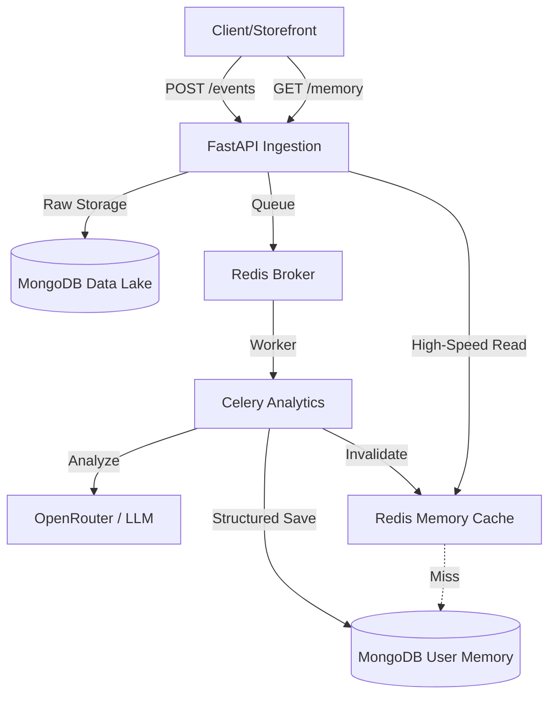

# Zave Memory System 🧠

Zave is a high-performance, real-time user behavioral analysis engine designed for modern e-commerce. It transforms noisy, unstructured clickstream logs into a multi-layered "User Memory" profile that powers hyper-personalization at sub-10ms speeds.

---

## 🚀 The "Zave" Philosophy

Most systems filter data *before* storing it, losing valuable context forever. Zave uses a **Data Lake** architecture:
1. **Raw Ingestion**: We capture every raw event (logs, text, JSON) exactly as it arrives.
2. **Asynchronous Brain**: LLMs process this "lake" in the background to extract behavioral signals.
3. **Evolving Memory**: If our AI logic improves tomorrow, we can re-process the raw data lake to build even better user profiles.

---

## 🏗️ Technical Architecture



---

## 🛠️ Features & Stack

- **Data Lake Ingestion**: Handles raw, unstructured text/logs (`RawEvent` model).
- **4-Layer Memory Model**:
    - **Persistent**: Long-term preferences (price sensitivity, categories).
    - **Episodic**: Chronological action timeline (bounded to last 100).
    - **Semantic**: Deduplicated conceptual interests.
    - **Contextual**: Short-term session focus.
- **Async Pipeline**: FastAPI + Celery + Redis for 100% non-blocking ingestion.
- **LLM Guardrails**: Pydantic validation strips out LLM hallucinations before DB insertion.
- **Performance**: Sub-10ms retrieval via Redis-backed Cache-Aside pattern.

---

## 🚦 Quick Start & Demo Guide

### 1. Boot the Stack
Ensure you have your `OPENROUTER_API_KEY` in the `.env` file, then run:
```bash
docker-compose up -d --build
```

### 2. Run the Live Simulation
The simulation script mimics real user behavior and handles the polling for the background processing:
```bash
python scripts/simulate_events.py
```

### 3. Verification & Demo (Swagger)
Open **`http://localhost:8000/docs`** and follow these steps to wow the judges:

1. **Authorize**: Click the padlock and enter your `API_KEY`.
2. **Check the Data Lake**: Use `GET /users/{user_id}/events/raw`. This proves we saved the *original, noisy* inputs before processing.
3. **Show the Intelligence**: Use `GET /users/{user_id}/memory`. This shows the beautifully structured JSON output of the LLM.
4. **Prove the Speed (The "Mic Drop")**:
    - Open your browser's **Network Tab** (F12).
    - Click **"Execute"** on the `/memory` endpoint once. (Watch the ~80ms Mongo fetch).
    - Click **"Execute"** again immediately. (Watch the **~2ms** Redis Cache hit).
---

## 🛠️ Core Deliverables & Trade-offs

### ✅ Requirement Checklist
- [x] **GitHub Repository**: [Zave Memory Management](https://github.com/geeked-anshuk666/Zave-memory-management)
- [x] **README**: Comprehensive architecture and philosophy.
- [x] **API Documentation**: Automated Swagger UI at `/docs`.
- [x] **Sample Data & Scripts**: Realistic simulation in `scripts/simulate_events.py`.
- [x] **Professional Commentary**: Every file documented for human clarity.

### ⚖️ Architecture Trade-offs
1. **Eventual Consistency vs. Real-time Ingestion**: We chose an **asynchronous (Celery)** model. *Trade-off:* User memory isn't updated *instantly* (takes ~5-15s), but the API response for the storefront stays incredibly fast (<30ms).
2. **MongoDB vs. SQL**: We chose **MongoDB**. *Trade-off:* Losing relational constraints, but gaining the ability to store deeply nested, evolving "Cognitive Layers" without migrations.
3. **Redis Cache-Aside**: *Trade-off:* We use extra RAM for caching, but the millisecond performance gain for the end-user outweighs the infrastructure cost.
4. **Data Lake Approach**: *Trade-off:* Increased storage usage by keeping "raw" data, but providing a 100% accurate audit trail and future-proofing the AI logic.

---

## ⚖️ License
MIT - Built for the Zave Behavioral Hackathon.
